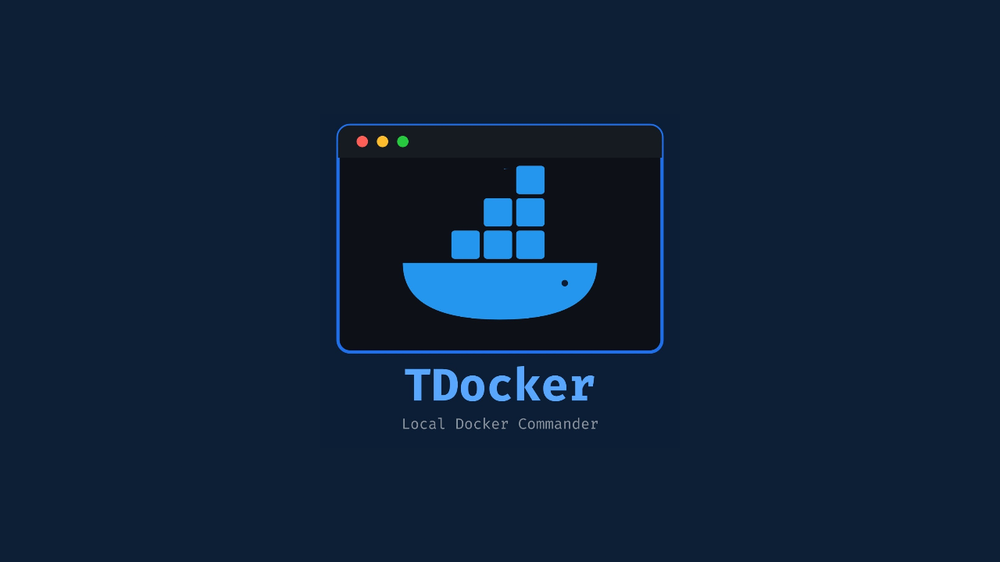

<div align="center">
  

# 🐳 TDocker - Terminal Docker Manager

</div>


TDocker is a lightweight terminal-based Docker management tool designed to simplify container deployment, updates, HTTPS integration, cleanup, and day-to-day administration without relying on heavy web dashboards.

It provides a single interactive interface for managing Docker containers, generating Compose configurations, enabling HTTPS with Caddy, updating services, and keeping Docker environments organized.

Built for developers, homelab users, self-hosting enthusiasts, and anyone who prefers working directly from the terminal.

---

# ✨ Features

### 🚀 Deploy Containers

Create and launch new containers from a simple interactive menu.

TDocker automatically generates the required Docker Compose configuration and starts the container for you.

---

### 🔒 Import Existing Containers

Already running a container?

Import it into TDocker management without rebuilding everything from scratch.

The tool automatically detects:

* Container image
* Internal ports
* External ports
* Mounted volumes
* Existing configuration

Then generates a reusable Compose file.

---

### 🌐 HTTPS Integration

Enable HTTPS access using Caddy Proxy.

When encryption is enabled, TDocker automatically:

* Connects containers to the required network
* Configures routing labels
* Creates HTTPS-enabled local domains
* Simplifies local development and testing

Example:

```text
https://myapp.localhost
```

---

### 🛠️ Container Management Dashboard

Manage containers directly from the terminal.

Available actions include:

* Start
* Stop
* Restart
* Pause
* Resume
* Kill
* Remove
* Rename
* Change image
* Modify ports
* Recreate configuration

No manual Compose editing required.

---

### 🔄 Update All Containers

Update all managed services from a single menu option.

TDocker can:

* Pull latest images
* Recreate containers
* Apply updates automatically

Useful for maintaining multiple self-hosted applications.

---

### 🧹 Docker Cleanup & Space Recovery

Docker environments accumulate unused resources over time.

TDocker includes a cleanup mode that shows a preview before making any changes.

The cleanup process can remove:

* Stopped containers
* Dangling images
* Unused images
* Unused networks
* Build cache
* Temporary Docker files
* Partial downloads
* Unused volumes

Before removal, TDocker displays a summary and estimated storage recovery.

Running containers and active resources remain untouched.

---

### ⚙️ Docker Configuration Management

Manage custom Docker daemon configurations safely.

TDocker can:

* Create daemon.json
* Store it in a custom location
* Create symbolic links automatically
* Restart Docker when required

---

### 🔍 Automatic Environment Checks

On startup, TDocker verifies:

* Docker installation
* Docker Compose availability
* Docker root directory
* Caddy Proxy status
* Docker configuration status

Helping identify issues before deployment.

---

# 📊 Feature Overview

| Feature                   | Supported |
| ------------------------- | --------- |
| Container Deployment      | ✅         |
| Existing Container Import | ✅         |
| Docker Compose Generation | ✅         |
| HTTPS Integration         | ✅         |
| Container Updates         | ✅         |
| Container Dashboard       | ✅         |
| Docker Cleanup            | ✅         |
| Volume Management         | ✅         |
| Docker Configuration      | ✅         |

---

# ⚠️ Requirements

TDocker requires:

* Docker Engine
* Docker Compose

Verify installation:

```bash
docker --version
docker compose version
```

---

## Debian / Ubuntu

```bash
sudo apt update
sudo apt install docker.io docker-compose-v2
sudo systemctl enable --now docker
```

---

## Fedora

```bash
sudo dnf install docker docker-compose
sudo systemctl enable --now docker
```

---

## Arch Linux

```bash
sudo pacman -S docker docker-compose
sudo systemctl enable --now docker
```

---

### Optional

Add your user to the Docker group:

```bash
sudo usermod -aG docker $USER
```

Log out and back in for the change to take effect.

---

# 🚀 Installation

Download the latest version:

```bash
wget https://raw.githubusercontent.com/mohamedmohsenofficial/tdocker/main/tdocker
```

Make it executable:

```bash
chmod +x tdocker
```

Move it into your PATH:

```bash
sudo mv tdocker /usr/local/bin/
```

Launch:

```bash
tdocker
```

---

# 💻 Usage

Start the tool:

```bash
tdocker
```

On first launch:

1. Select a working directory
2. Choose an action from the menu
3. Follow the prompts
4. Deploy or manage containers

---

# 📋 Main Menu

```text
1. Import & Encrypt Existing Container
2. Deploy New Container
3. Manage / Edit Container
4. Update All Containers
5. Setup Custom daemon.json
6. Docker Cleanup & Space Recovery
```

---

# 🏆 Comparison

| Feature                | TDocker  | Portainer | Docker CLI |
| ---------------------- | -------- | --------- | ---------- |
| Terminal Based         | ✅        | ❌         | ✅          |
| Interactive Management | ✅        | ✅         | ❌          |
| Compose Generation     | ✅        | Partial   | Manual     |
| HTTPS Integration      | ✅        | Manual    | Manual     |
| Bulk Updates           | ✅        | Partial   | Manual     |
| Cleanup Preview        | ✅        | ❌         | Manual     |
| Resource Usage         | Very Low | Higher    | Very Low   |

---

# 📂 Project Structure

```text
Docker/
├── app1/
├── app2/
├── app1-compose.yml
├── app2-compose.yml
├── config/
└── backups/
```

---

# 🤝 Contributing

Open-source project powered by the community.

Contributions are welcome for:

* New container management features
* Better Docker workflows
* Documentation improvements
* Bug fixes
* Performance optimizations

Feel free to open an Issue or Pull Request.

---

# 📜 License

This project is released under the MIT License.

You are free to:

* Use
* Modify
* Distribute
* Fork

for personal and commercial projects.

---


## 💖 Support

If you find this project useful, consider supporting its development. Every contribution helps improve features, maintain the project, and keep it accessible for everyone. 🌍✨

<p align="left">
  <a href="https://www.buymeacoffee.com/mohsenofficial" target="_blank">
    
  </a>
</p>

---

Created by [Mohamed Mohsen](https://www.linkedin.com/in/mohsenofficial)) 💙

Built with passion, curiosity, countless hours of learning, and a deep love for open-source software.

Thank you for using this project and being part of its journey. 🤟🏼😘
